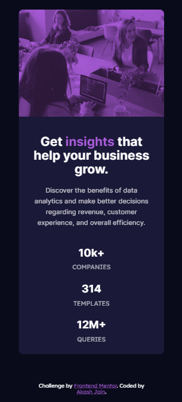

# Frontend Mentor - Stats preview card component solution

This is a solution to the [Stats preview card component challenge on Frontend Mentor](https://www.frontendmentor.io/challenges/stats-preview-card-component-8JqbgoU62). Frontend Mentor challenges help you improve your coding skills by building realistic projects. 

## Table of contents

- [Overview](#overview)
  - [The challenge](#the-challenge)
  - [Screenshot](#screenshot)
  - [Links](#links)
- [My process](#my-process)
  - [Built with](#built-with)
  - [What I learned](#what-i-learned)
- [Useful resources](#useful-resources)
- [Author](#author)
- [Acknowledgments](#acknowledgments)

## Overview

### The challenge

Users should be able to:

- View the optimal layout depending on their device's screen size

### Screenshots

Desktop View

Mobile View

### Links

- Solution URL: [Solution](https://www.frontendmentor.io/solutions/stats-preview-card-component-S1470kxSc)
- Live Site URL: [GitHub Pages](https://github.com/Akash20x/stats-preview-card-component)

## My process

### Built with

- Semantic HTML5 markup
- CSS custom properties
- Flexbox
- Mobile-first workflow

### What I learned

Though my main focus was on building I also learned so much about design in general (font-sizes, colors etc).
Also, I had some experience with Figma before but with this assignment I definitely feel more comfortable working with it.
I have so much yet to learn and to develop my skills - the learning never stops! :-)

### Useful resources

- [https://www.w3schools.com/cssref/pr_mix-blend-mode.asp]- This helped me to understand and use the mix blend mode.
- [https://www.w3schools.com/tags/att_source_srcset.asp]- This helped me to understand and use the HTML <source> srcset Attribute.

## Author

- Frontend Mentor - [@akash](https://www.frontendmentor.io/profile/nurme-ave)
- Github - [Akash Jain](https://github.com/nurme-ave)

## Acknowledgments

I would like to thank Frontend Mentor for building such a brilliant learning platform! :-)
